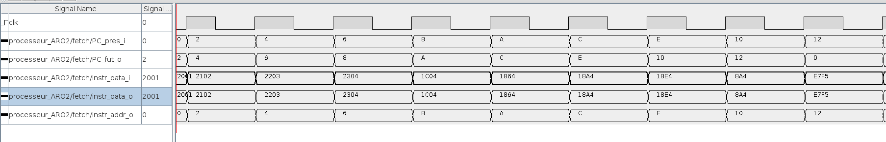
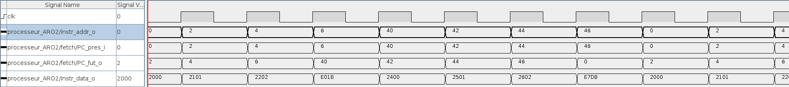

# ARO laboratoire 1 Fetch

# Question 1
L'incrémentation du PC à la valeur 2 car nous utilisons un processeur 16 bits. C'est-à-dire, pour passer à la prochaine instruction en mémoire nous devons avancer de 16 bits soit 2 octets.

# Question 2

Ce chronogramme représente la "recherche" ou `fetch` d'instructions, l'éxécution de ceux-ci ainsi que l'incrémentation automatique de l'adresse.

La ligne `.../PC_fut_o` à une valeur toujours 2 au dessus de `.../PC_pres_i` ce qui démontre l'incrémentation de 2 octets pour passer à la prochaine instruction. Le fait que `.../PC_pres_i` prend ensuite la valeur qu'avait `.../PC_fut_o` démontre que l'incrémentationà réellement lieu.

Les lignes `.../instr_data_i` et `.../instr_data_i` sont indentique car il n'y a aucune modification des instructions durant l'éxécution.

Finalement l'adresse de l'instruction actuelle (`.../instr_addr_o`) est la même que `PC_pres_i` pour montrer que le PC lit à chaque fois l'instruction à l'adresse demandée.

# Question 3

Ce chronogramme représente le fonctionnement du saut en avant et en arrière.

Sur ce diagramme on montre à nouveau la différence entre le `.../PC_pres_i` et le `.../PC_fut_o`. Cette fois par contre au moment où on atteint l'instruction `E01B` on fait un saut à l'adresse `0x40`.
Ceci est démontré comme avant en étant dans `.../PC_fut_o` pour ensuite devenir l'adresse actuelle dans `.../PC_pres_i` et `.../instr_addr_o`.

Pour le saut en arrière, on effectue l'instruction `E7DB` qui donne un offset négatif pour revenir à l'adresse `0x0` pour recommencer le programme.

Nous voyons la circularité du programme quand il revient au début et recommence les même étapes.

# Question 4
C'est une valeur non signée car elle représente l'adresse à laquelle il faut sauter. Ceci à ne pas confondre avec l'offset depuis l'adresse actuelle.